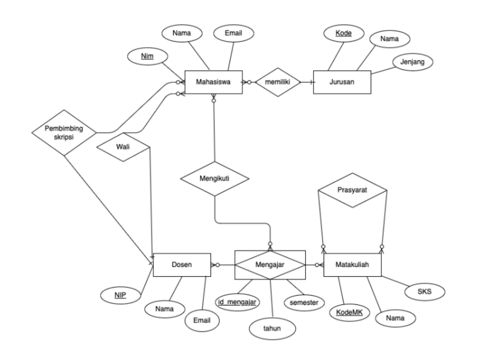

# Modul Week 9 — Implementasi ERD ke MySQL

**Mata Kuliah:** Basis Data
**Topik:** Implementasi Entity-Relationship Diagram (ERD) ke dalam Database MySQL

---

## Tujuan Pembelajaran

Setelah menyelesaikan modul ini, mahasiswa diharapkan mampu:

1. Membaca dan memahami diagram ERD.
2. Mengidentifikasi entitas, atribut, dan relasi dari sebuah ERD.
3. Menerjemahkan ERD menjadi skema tabel relasional.
4. Menulis perintah DDL (`CREATE TABLE`) beserta *primary key* dan *foreign key*.
5. Mengisi tabel dengan data dummy menggunakan perintah DML (`INSERT`).
6. Memverifikasi hasil implementasi dengan perintah `SELECT`.

---

## 1. Pengantar

ERD (*Entity-Relationship Diagram*) adalah alat desain basis data yang menggambarkan:

| Simbol | Arti |
|---|---|
| Persegi panjang | **Entitas** (tabel) |
| Elips | **Atribut** (kolom) |
| Belah ketupat | **Relasi** antara entitas |
| Elips bergaris bawah | **Primary Key** |

Setelah ERD selesai dirancang, langkah selanjutnya adalah mengimplementasikannya ke dalam sistem manajemen basis data (DBMS), pada modul ini menggunakan **MySQL**.

---

## 2. ERD Sistem Akademik

Berikut adalah ERD yang akan kita implementasikan:



### Analisis ERD

Dari gambar di atas, kita mengidentifikasi:

#### Entitas dan Atributnya

| Entitas | Primary Key | Atribut Lain |
|---|---|---|
| **Mahasiswa** | NIM | Nama, Email |
| **Jurusan** | Kode | Nama, Jenjang |
| **Dosen** | NIP | Nama, Email |
| **Matakuliah** | KodeMK | Nama, SKS |

#### Relasi

| Relasi | Entitas Terlibat | Kardinalitas | Keterangan |
|---|---|---|---|
| **memiliki** | Mahasiswa — Jurusan | N : 1 | Banyak mahasiswa di satu jurusan |
| **Wali** | Mahasiswa — Dosen | N : 1 | Satu dosen mengawali banyak mahasiswa |
| **Pembimbing Skripsi** | Mahasiswa — Dosen | N : 1 | Satu dosen membimbing banyak mahasiswa |
| **Mengajar** | Dosen — Matakuliah | N : M | Entitas asosiatif dengan atribut semester & tahun |
| **Mengikuti** | Mahasiswa — Mengajar | N : M | Mahasiswa mendaftar ke kelas tertentu (KRS) |
| **Prasyarat** | Matakuliah — Matakuliah | N : M | Relasi rekursif / unary |

> **Catatan:** Relasi **Wali** dan **Pembimbing Skripsi** keduanya menghubungkan Mahasiswa ke Dosen, sehingga pada tabel Mahasiswa akan ada **dua foreign key** yang sama-sama merujuk ke tabel Dosen.

---

## 3. Aturan Konversi ERD ke Tabel Relasional

Sebelum menulis SQL, pahami aturan konversi berikut:

### 3.1 Entitas Kuat → Tabel Mandiri
Setiap entitas kuat langsung menjadi tabel, dengan primary key sesuai atribut yang bergaris bawah pada ERD.

### 3.2 Relasi One-to-Many (1:N)
Tambahkan **foreign key** pada sisi tabel yang "banyak" (N), merujuk ke primary key sisi "satu" (1).

```
Mahasiswa (N) → memiliki → Jurusan (1)
Solusi: tambah kolom kode_jurusan di tabel Mahasiswa
```

### 3.3 Relasi Many-to-Many (N:M)
Buat **tabel baru (junction table)** yang memuat primary key dari kedua entitas sebagai foreign key, dan jadikan kombinasi keduanya sebagai composite primary key.

```
Dosen (N) ↔ Mengajar ↔ Matakuliah (M)
Solusi: buat tabel Mengajar(id_mengajar, nip_dosen, kode_mk, semester, tahun)
```

### 3.4 Relasi Rekursif (Unary)
Buat **tabel terpisah** yang memuat primary key entitas tersebut dua kali: satu sebagai subjek, satu sebagai referensi.

```
Matakuliah ↔ Prasyarat ↔ Matakuliah
Solusi: buat tabel Prasyarat(kode_mk, kode_mk_prasyarat)
```

---

## 4. Implementasi DDL — Membuat Database dan Tabel

### 4.1 Membuat Database

```sql
DROP DATABASE IF EXISTS sistem_akademik;
CREATE DATABASE sistem_akademik CHARACTER SET utf8mb4 COLLATE utf8mb4_unicode_ci;
USE sistem_akademik;
```

> `CHARACTER SET utf8mb4` memastikan database mendukung karakter Unicode penuh, termasuk huruf beraksara dan emoji.

---

### 4.2 Tabel Jurusan

Entitas independen, tidak bergantung pada entitas lain.

```sql
CREATE TABLE Jurusan (
    kode        VARCHAR(10)  NOT NULL,
    nama        VARCHAR(100) NOT NULL,
    jenjang     VARCHAR(5)   NOT NULL,  -- S1, S2, D3, dst.
    CONSTRAINT pk_jurusan PRIMARY KEY (kode)
);
```

---

### 4.3 Tabel Dosen

Entitas independen, tidak bergantung pada entitas lain.

```sql
CREATE TABLE Dosen (
    nip         VARCHAR(20)  NOT NULL,
    nama        VARCHAR(100) NOT NULL,
    email       VARCHAR(100),
    CONSTRAINT pk_dosen PRIMARY KEY (nip)
);
```

---

### 4.4 Tabel Mahasiswa

Tabel ini memiliki **tiga foreign key**:
- `kode_jurusan` → relasi *memiliki* ke Jurusan
- `nip_wali` → relasi *Wali* ke Dosen
- `nip_pembimbing` → relasi *Pembimbing Skripsi* ke Dosen

> Karena dua FK (`nip_wali` dan `nip_pembimbing`) sama-sama merujuk ke tabel Dosen, masing-masing harus diberi **nama constraint yang berbeda**.

```sql
CREATE TABLE Mahasiswa (
    nim             VARCHAR(15)  NOT NULL,
    nama            VARCHAR(100) NOT NULL,
    email           VARCHAR(100),
    kode_jurusan    VARCHAR(10)  NOT NULL,
    nip_wali        VARCHAR(20),
    nip_pembimbing  VARCHAR(20),
    CONSTRAINT pk_mahasiswa         PRIMARY KEY (nim),
    CONSTRAINT fk_mhs_jurusan       FOREIGN KEY (kode_jurusan)   REFERENCES Jurusan(kode),
    CONSTRAINT fk_mhs_wali          FOREIGN KEY (nip_wali)       REFERENCES Dosen(nip),
    CONSTRAINT fk_mhs_pembimbing    FOREIGN KEY (nip_pembimbing) REFERENCES Dosen(nip)
);
```

> `nip_wali` dan `nip_pembimbing` diset `NULL`-able karena tidak semua mahasiswa wajib memiliki pembimbing skripsi (misalnya mahasiswa semester awal).

---

### 4.5 Tabel Matakuliah

```sql
CREATE TABLE Matakuliah (
    kode_mk     VARCHAR(10)  NOT NULL,
    nama        VARCHAR(100) NOT NULL,
    sks         TINYINT      NOT NULL,
    CONSTRAINT pk_matakuliah PRIMARY KEY (kode_mk)
);
```

---

### 4.6 Tabel Prasyarat (Relasi Rekursif)

Relasi rekursif (*self-referencing*): satu matakuliah menjadi prasyarat bagi matakuliah lain. Composite primary key `(kode_mk, kode_mk_prasyarat)` mencegah duplikasi baris yang sama.

```sql
CREATE TABLE Prasyarat (
    kode_mk              VARCHAR(10) NOT NULL,
    kode_mk_prasyarat    VARCHAR(10) NOT NULL,
    CONSTRAINT pk_prasyarat     PRIMARY KEY (kode_mk, kode_mk_prasyarat),
    CONSTRAINT fk_prs_mk        FOREIGN KEY (kode_mk)            REFERENCES Matakuliah(kode_mk),
    CONSTRAINT fk_prs_mk_prs    FOREIGN KEY (kode_mk_prasyarat)  REFERENCES Matakuliah(kode_mk)
);
```

---

### 4.7 Tabel Mengajar (Entitas Asosiatif N:M)

Relasi *Mengajar* antara Dosen dan Matakuliah memiliki atribut sendiri (`semester`, `tahun`), sehingga menjadi **entitas asosiatif** dengan surrogate key `id_mengajar`.

```sql
CREATE TABLE Mengajar (
    id_mengajar INT          NOT NULL AUTO_INCREMENT,
    nip_dosen   VARCHAR(20)  NOT NULL,
    kode_mk     VARCHAR(10)  NOT NULL,
    semester    VARCHAR(15)  NOT NULL,  -- Ganjil / Genap
    tahun       YEAR         NOT NULL,
    CONSTRAINT pk_mengajar  PRIMARY KEY (id_mengajar),
    CONSTRAINT fk_mgj_dosen FOREIGN KEY (nip_dosen) REFERENCES Dosen(nip),
    CONSTRAINT fk_mgj_mk    FOREIGN KEY (kode_mk)   REFERENCES Matakuliah(kode_mk)
);
```

---

### 4.8 Tabel Mengikuti (Junction Table N:M)

Relasi *Mengikuti* menghubungkan Mahasiswa dengan kelas (Mengajar). Composite primary key `(nim, id_mengajar)` memastikan satu mahasiswa hanya terdaftar sekali di kelas yang sama.

```sql
CREATE TABLE Mengikuti (
    nim         VARCHAR(15) NOT NULL,
    id_mengajar INT         NOT NULL,
    CONSTRAINT pk_mengikuti  PRIMARY KEY (nim, id_mengajar),
    CONSTRAINT fk_mgt_mhs    FOREIGN KEY (nim)         REFERENCES Mahasiswa(nim),
    CONSTRAINT fk_mgt_mgj    FOREIGN KEY (id_mengajar) REFERENCES Mengajar(id_mengajar)
);
```

---

### Urutan Pembuatan Tabel

> **Mengapa urutan penting?**
> Foreign key hanya bisa merujuk ke tabel yang **sudah ada**. Jika tabel induk belum dibuat, MySQL akan menolak perintah `CREATE TABLE` dengan error `errno: 150`.

Ikuti urutan berikut dari atas ke bawah:

| Langkah | Tabel | Alasan |
|:---:|---|---|
| 1 | `Jurusan` | Tidak bergantung pada tabel lain |
| 2 | `Dosen` | Tidak bergantung pada tabel lain |
| 3 | `Matakuliah` | Tidak bergantung pada tabel lain |
| 4 | `Mahasiswa` | Butuh `Jurusan` dan `Dosen` sudah ada |
| 5 | `Prasyarat` | Butuh `Matakuliah` sudah ada |
| 6 | `Mengajar` | Butuh `Dosen` dan `Matakuliah` sudah ada |
| 7 | `Mengikuti` | Butuh `Mahasiswa` dan `Mengajar` sudah ada |

Secara visual, anak panah `→` berarti *"harus dibuat lebih dulu"*:

```
Jurusan ──┐
          ├──→ Mahasiswa ──┐
Dosen   ──┤               │
          └──→ Mengajar ──┼──→ Mengikuti
                    ↑      │
Matakuliah ─────────┘      │
     └──→ Prasyarat        │
                           │
          ─────────────────┘
```

---

## 5. Implementasi DML — Mengisi Data (INSERT)

### 5.1 Data Jurusan

```sql
INSERT INTO Jurusan (kode, nama, jenjang) VALUES
    ('IF',  'Teknik Informatika',          'S1'),
    ('SI',  'Sistem Informasi',            'S1'),
    ('TK',  'Teknik Komputer',             'S1'),
    ('MTI', 'Magister Teknik Informatika', 'S2'),
    ('MI',  'Manajemen Informatika',       'D3');
```

### 5.2 Data Dosen

```sql
INSERT INTO Dosen (nip, nama, email) VALUES
    ('198501012010011001', 'Dr. Ahmad Fauzi, M.Kom',    'ahmad.fauzi@univ.ac.id'),
    ('197803152005012002', 'Dr. Siti Rahayu, M.T',      'siti.rahayu@univ.ac.id'),
    ('198209202008011003', 'Budi Santoso, S.Kom, M.Cs', 'budi.santoso@univ.ac.id'),
    ('197512102003012004', 'Dewi Anggraini, M.Kom',     'dewi.anggraini@univ.ac.id'),
    ('198811252015011005', 'Rizky Pratama, M.T',        'rizky.pratama@univ.ac.id');
```

### 5.3 Data Matakuliah

```sql
INSERT INTO Matakuliah (kode_mk, nama, sks) VALUES
    ('MK001', 'Basis Data',                3),
    ('MK002', 'Pemrograman Web',           3),
    ('MK003', 'Struktur Data',             3),
    ('MK004', 'Algoritma dan Pemrograman', 3),
    ('MK005', 'Sistem Operasi',            3),
    ('MK006', 'Jaringan Komputer',         3),
    ('MK007', 'Rekayasa Perangkat Lunak',  3),
    ('MK008', 'Kecerdasan Buatan',         3);
```

### 5.4 Data Prasyarat

```sql
INSERT INTO Prasyarat (kode_mk, kode_mk_prasyarat) VALUES
    ('MK001', 'MK004'),   -- Basis Data         ← Algoritma dan Pemrograman
    ('MK002', 'MK004'),   -- Pemrograman Web     ← Algoritma dan Pemrograman
    ('MK003', 'MK004'),   -- Struktur Data       ← Algoritma dan Pemrograman
    ('MK007', 'MK003'),   -- RPL                 ← Struktur Data
    ('MK008', 'MK003'),   -- Kecerdasan Buatan   ← Struktur Data
    ('MK006', 'MK005');   -- Jaringan Komputer   ← Sistem Operasi
```

### 5.5 Data Mahasiswa

> `nip_pembimbing` bernilai `NULL` untuk mahasiswa yang belum memiliki pembimbing skripsi.

```sql
INSERT INTO Mahasiswa (nim, nama, email, kode_jurusan, nip_wali, nip_pembimbing) VALUES
    ('2021001001', 'Andi Wijaya',     'andi.wijaya@student.univ.ac.id',     'IF', '198501012010011001', '197803152005012002'),
    ('2021001002', 'Bela Safitri',    'bela.safitri@student.univ.ac.id',    'IF', '198501012010011001', '198209202008011003'),
    ('2021001003', 'Candra Kusuma',   'candra.kusuma@student.univ.ac.id',   'SI', '197803152005012002', '198501012010011001'),
    ('2021001004', 'Diana Pertiwi',   'diana.pertiwi@student.univ.ac.id',   'SI', '197803152005012002', '197512102003012004'),
    ('2021001005', 'Eko Prasetyo',    'eko.prasetyo@student.univ.ac.id',    'TK', '198209202008011003', '198811252015011005'),
    ('2021001006', 'Fitri Handayani', 'fitri.handayani@student.univ.ac.id', 'TK', '198209202008011003', '198501012010011001'),
    ('2021001007', 'Galang Ramadhan', 'galang.ramadhan@student.univ.ac.id', 'IF', '197512102003012004', '197803152005012002'),
    ('2021001008', 'Hani Lestari',    'hani.lestari@student.univ.ac.id',    'SI', '198811252015011005', '198209202008011003'),
    ('2021001009', 'Ivan Setiawan',   'ivan.setiawan@student.univ.ac.id',   'IF', '198501012010011001', NULL),
    ('2021001010', 'Julia Anggraeni', 'julia.anggraeni@student.univ.ac.id', 'MI', '197512102003012004', NULL);
```

### 5.6 Data Kelas Mengajar

```sql
INSERT INTO Mengajar (nip_dosen, kode_mk, semester, tahun) VALUES
    ('198501012010011001', 'MK001', 'Ganjil', 2024),  -- id_mengajar = 1
    ('198501012010011001', 'MK003', 'Genap',  2024),  -- id_mengajar = 2
    ('197803152005012002', 'MK002', 'Ganjil', 2024),  -- id_mengajar = 3
    ('197803152005012002', 'MK007', 'Genap',  2024),  -- id_mengajar = 4
    ('198209202008011003', 'MK004', 'Ganjil', 2024),  -- id_mengajar = 5
    ('198209202008011003', 'MK005', 'Genap',  2024),  -- id_mengajar = 6
    ('197512102003012004', 'MK006', 'Genap',  2024),  -- id_mengajar = 7
    ('198811252015011005', 'MK008', 'Ganjil', 2024),  -- id_mengajar = 8
    ('198501012010011001', 'MK001', 'Ganjil', 2025),  -- id_mengajar = 9
    ('197803152005012002', 'MK002', 'Ganjil', 2025);  -- id_mengajar = 10
```

### 5.7 Data KRS (Mengikuti)

```sql
INSERT INTO Mengikuti (nim, id_mengajar) VALUES
    ('2021001001', 1), ('2021001001', 3), ('2021001001', 5),
    ('2021001002', 1), ('2021001002', 6), ('2021001002', 8),
    ('2021001003', 3), ('2021001003', 4), ('2021001003', 5),
    ('2021001004', 1), ('2021001004', 3), ('2021001004', 7),
    ('2021001005', 5), ('2021001005', 6), ('2021001005', 8),
    ('2021001006', 2), ('2021001006', 5), ('2021001006', 7),
    ('2021001007', 1), ('2021001007', 8),
    ('2021001008', 3), ('2021001008', 4), ('2021001008', 6),
    ('2021001009', 9), ('2021001009', 5),
    ('2021001010', 5), ('2021001010', 6);
```

---

## 6. Verifikasi Data dengan SELECT

### 6.1 Daftar Mahasiswa beserta Jurusan dan Dosen Wali

Query ini menggunakan `JOIN` dan `LEFT JOIN`. `LEFT JOIN` digunakan agar mahasiswa yang belum punya pembimbing skripsi tetap muncul di hasil.

```sql
SELECT
    m.nim,
    m.nama                  AS mahasiswa,
    j.nama                  AS jurusan,
    j.jenjang,
    dw.nama                 AS dosen_wali,
    dp.nama                 AS pembimbing_skripsi
FROM Mahasiswa m
JOIN  Jurusan  j   ON m.kode_jurusan   = j.kode
LEFT JOIN Dosen dw ON m.nip_wali       = dw.nip
LEFT JOIN Dosen dp ON m.nip_pembimbing = dp.nip
ORDER BY m.nim;
```

**Contoh hasil:**

| nim | mahasiswa | jurusan | jenjang | dosen_wali | pembimbing_skripsi |
|---|---|---|---|---|---|
| 2021001001 | Andi Wijaya | Teknik Informatika | S1 | Dr. Ahmad Fauzi, M.Kom | Dr. Siti Rahayu, M.T |
| 2021001009 | Ivan Setiawan | Teknik Informatika | S1 | Dr. Ahmad Fauzi, M.Kom | *(NULL)* |

---

### 6.2 Jadwal Mengajar Dosen

```sql
SELECT
    mg.id_mengajar,
    d.nama      AS dosen,
    mk.nama     AS matakuliah,
    mk.sks,
    mg.semester,
    mg.tahun
FROM Mengajar mg
JOIN Dosen      d  ON mg.nip_dosen = d.nip
JOIN Matakuliah mk ON mg.kode_mk   = mk.kode_mk
ORDER BY mg.tahun, mg.semester, d.nama;
```

---

### 6.3 KRS Mahasiswa (Kartu Rencana Studi)

Query berantai (multi-join) menelusuri: Mahasiswa → Mengikuti → Mengajar → Matakuliah → Dosen.

```sql
SELECT
    mhs.nim,
    mhs.nama        AS mahasiswa,
    mk.kode_mk,
    mk.nama         AS matakuliah,
    mk.sks,
    mg.semester,
    mg.tahun,
    d.nama          AS dosen_pengampu
FROM Mengikuti  mgt
JOIN Mahasiswa  mhs ON mgt.nim         = mhs.nim
JOIN Mengajar   mg  ON mgt.id_mengajar = mg.id_mengajar
JOIN Matakuliah mk  ON mg.kode_mk      = mk.kode_mk
JOIN Dosen      d   ON mg.nip_dosen    = d.nip
ORDER BY mhs.nim, mg.tahun, mg.semester;
```

---

### 6.4 Daftar Prasyarat Matakuliah

```sql
SELECT
    mk.nama     AS matakuliah,
    mp.nama     AS prasyarat
FROM Prasyarat  p
JOIN Matakuliah mk ON p.kode_mk            = mk.kode_mk
JOIN Matakuliah mp ON p.kode_mk_prasyarat  = mp.kode_mk
ORDER BY mk.nama;
```

**Contoh hasil:**

| matakuliah | prasyarat |
|---|---|
| Basis Data | Algoritma dan Pemrograman |
| Jaringan Komputer | Sistem Operasi |
| Kecerdasan Buatan | Struktur Data |
| Pemrograman Web | Algoritma dan Pemrograman |
| Rekayasa Perangkat Lunak | Struktur Data |
| Struktur Data | Algoritma dan Pemrograman |

---

## 7. Rangkuman

| Konsep | Implementasi SQL |
|---|---|
| Entitas → Tabel | `CREATE TABLE` |
| Atribut → Kolom | Definisi kolom beserta tipe data |
| Primary Key | `CONSTRAINT ... PRIMARY KEY` |
| Relasi 1:N | Foreign key di sisi "banyak" |
| Relasi N:M | Junction table + composite primary key |
| Relasi rekursif | Self-referencing foreign key |
| Atribut relasi | Kolom tambahan di junction table |
| Mengisi data | `INSERT INTO ... VALUES` |
| Membaca data lintas tabel | `JOIN` / `LEFT JOIN` |

---

## 8. Latihan

1. **DDL** — Tambahkan kolom `tanggal_lahir DATE` pada tabel `Mahasiswa`. Gunakan `ALTER TABLE`.
2. **DML** — Tambahkan 3 mahasiswa baru dari jurusan `MTI` dengan dosen wali dan pembimbing skripsi masing-masing.
3. **DML** — Daftarkan mahasiswa baru tersebut ke minimal 2 kelas di tabel `Mengajar`.
4. **SELECT** — Tampilkan daftar matakuliah beserta jumlah mahasiswa yang mengikutinya, diurutkan dari yang paling banyak diminati.
5. **SELECT** — Tampilkan nama dosen beserta jumlah kelas yang mereka ajarkan pada tahun 2024.
6. **Tantangan** — Tampilkan mahasiswa yang mengambil matakuliah tanpa memenuhi prasyaratnya *(hint: gunakan subquery atau NOT EXISTS)*.

---

## Referensi

- Elmasri, R. & Navathe, S. B. (2016). *Fundamentals of Database Systems*, 7th Ed. Pearson.
- Silberschatz, A., Korth, H. F., & Sudarshan, S. (2019). *Database System Concepts*, 7th Ed. McGraw-Hill.
- MySQL 8.0 Reference Manual — [https://dev.mysql.com/doc/refman/8.0/en/](https://dev.mysql.com/doc/refman/8.0/en/)
